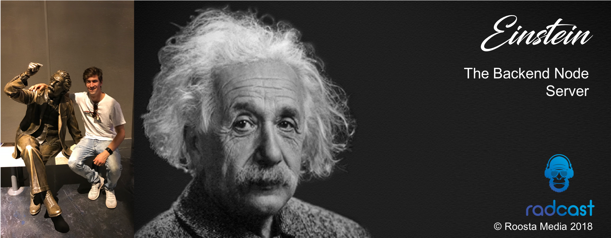

# Radcast Audio Stitcher Microservice: Einstein

## Overview

This is a micro-service written for serverless architecture (currently running on AWS Lambda) that performs audio processing and metadata creation for a single user's radcast. 

## Application runtime & environment
---
### Runtime
This app uses the Node.js framework and is designed to be run remotely as an AWS Lambda function. It is absolutely **CRITICAL** that anyone working on this project make themselves familiar with the setup configuration - as there are a number of config steps that can easily go wrong, rendering the code non-functional. Full set up instructions are documented in the [setup.md](./supporting-files/setup.md) document. This doc also contains information on how to deploy the projet to the Lambda function. 

### Performance
The function configuration - memory allocation & effects on timing and costing - has been tested and the results are documented in a [Google Sheet](https://docs.google.com/spreadsheets/d/1l9xNUoYdZtlUZJ8VE4-Dk45Pbts_B4DJWCSp2LL97VM/edit?usp=sharing). 

### A little bit about AWS Lambda
It's highly advisable that you become familiar with nuances associated with Lambda functions before working on this code - like cold start effects, max execution time, ephemerality of memory, invocation etc etc. In summary though, a Lambda function is a docker container managed by AWS for you. Every time your function is invoked (various options for this) AWS will spin up a new instance, allow it to perform the work, and once complete, the instance will be destroyed. It suits applications that are lightweight, stateless, and completely modular (amongst other qualities).  

### Quick Start
---

This project shouldn't have a quick start actually. You should read the entire setup document. But anyway, you're probably a millenial, so here goes:

 1. Export the function from the AWS console by selecting **Actions** --> **Export function**. Or you can check it out from it's repository.
 2. Set up AWS `sam cli`: `$ pip install --user aws-sam-cli` 
 3. Make sure the sam binary is globally available in your shell: `$ export PATH=$PATH:~/Library/Python/2.7/bin` where the path is the path to where your pip modules install to
 4. Restart your shell, and type `$ sam --version` - it should display the version, if it doesn't something has gone wrong.
 5. The template.yaml file should be included in the git repo, so you shouldn't have to run `$ sam init`
 6. Install the required dependancies: `$ npm install`
 7. **Running:** Use `$ sam local invoke "createSingleRadcast" -e test/unit_test_radcast_dev.json` This should start a docker container on your local machine and invoke the function with an input.
 8. You can use the debugger of your choice - connect it to port 5858.
 9. If you were running any other Docker containers with port 5858 open as a debug port, you may need to restart Docker.  

#### Pre-requisites

* Docker 
* Python2.7 or Python3.6

### Debug

`$ sam local invoke "createSingleRadcast" -e test/unit_test_radcast_dev.json --debug-port 5858`

## Project Structure

|-- audio-handling
|     |-- audio-manager: Class that handles audio download, transcoding and upload
|-- config
|     |-- api_key.js: Key to validate requests with
|     |-- constants.js: General project constants
|     |-- radcast-audio-private-key.json: Firebase project service account key 
|-- models: .* Model classes to represent Radacst data structures
|-- node_modules: external dependancies / packages
|-- radcast-creation
|     |-- radcast_creator.js: Manager class that manages the sequential process of creating radcasts
|     |-- session_metrics.js: Class that records and reports metrics about the creation session (duration, success rate etc)
|-- supporting-files: *. Non-source-code files to aid with project set up / documentation
|-- test: *. Invocation source files for different types of tests
|-- utilities:
|     |-- utilities.js: Arbitrary, generic functions required around the project
|-- index.js: 'Main' file to which the event object that generated the invocation is passed.
|-- package-lock.json: npm generated after `npm install`, represents exact, explicit, versioned and full dependency tree.
|-- package.json: User defined dependencies
|-- readme.md: You are here.
|-- template.yaml: Defines the environment/resources AWS must create to test the function locally. Note these configurations don't extend to the hosted function. Those must be set in the AWS console.

## Radcast Creation

On invocation, the function should be supplied 1 user UID to create a radcast for. After this event, the following will happen:

 1. All active feeds and their episodes are downloaded, as well as the user's feed subscriptions
 2. Episode validation: Checks the episodes pointed to by the user records are valid
 3. Audio stitching: Loads individual files from GCS, transcodes and concatenates them into 1 radcast audio file, then saves (uploads) the output to GCS
 4. Writes the metadata related to the radcast to the relevant subcollection of the user's doc

 (Will add image when I get back - I don't want to risk the package being too big to deploy)

### Episode Validation

Episode validation requires the following to requirements to pass:

 1. User must be actively subscribed to the feed: `activeSubscription: true`
 2. Story episode: 
   2.1 `active: true`
   2.2 `audioURL: <String>` (i.e. non-null)
   2.3 `episodeIndex:` >= user's index for that feed
 3. Daily episode:
   3.1 `currentDate - 2ds <= relevantDate <= currentDate +  hrs`
   3.2 `audioURL: <String>` (i.e. non-null)

#### Latest Feed & Episode Data

The process of episode validation involves downloading all active feeds and their *episodes* subcollections. The data for each feed and episode are fed to classes in the project and used to instantiated objects. This is for coherence and modularity. The [feed class](./models/feed.js) has it's episodes stored by 1) episode UIDs and 2) By index. 

### Radcast audio creation

Once validated episodes have been acquired, a `radcast` object is created (to hold the metadata specific to the radcast), and an `AudioManager` object is create to perform the following:

  1. Download individual episode audio files
  2. Concatenate these audio files 
  3. Upload the resultant file to GCS

#### Audio download process

The audio download and stitching process is complicated by _**general intros**_, and _**context intros**_. General intros (which can be disables by users) feature at the beginning of radcasts if they exist, then come context intros - which again may or may not exist, depending on whether the content team have uploaded them for a particular episode, then come the episodes in the user's set priority order. A radcast intro and episode order could look like this:

The complication here is that context intro metadata is coupled to its relevant episode document, and it doesn't have a priority of its own - this needs to be inferred at radcast creation time. The `AudioDownload` class is used to aid with sequenctial downloading and ordering during downloading and audio concatenation. The methodology is difficult to explain simply, but here's my best attempt:

 1. `AudioDownload` objects are created for all **main** episode audio objects - they are ordered by priority and injected into a `downloadSequence` array on the `Radcast` object. If required, on a second pass, `AudioDownload` objects are created for context intros, and these objects are spliced into the `downloadSequence` array at the correct index - either 0, 1 depending on whether there is a welcome episode.
 2. Audio file's are downloaded in order using the `downloadSequence` Array.
 3. On successful download of each `AudioDownload` object, a `RadcastEpisode` is created and added to the `Radcast` object. The special case is for context intro's, where **only 1** `RadcastEpisode` is created for all context intros.
 4. Once download is complete, the `downloadSequence` array is again used to set up the audio concatenation. This is done using the **ffmpeg** library (described below). 
 5. The resultant radcast audio file is then uploaded to GCS.

#### Audio concatenation & transcoding

Audio concatenation is done using the **ffmpeg** library. This software needs to be compiled, which was difficult in the docker environment, hence we used a publicly available static binary. It's a mature piece of software, so should be fine to not update the binary frequently.

Before explaining how we concat the audio files, its important to understand the fundamentals in this process. Audio files are encoded raw digital audio data, and come in many different flavours of encoding. The key porperties to consider with audio encoding are:

 - Sampling rate
 - Bit depth
 - Frame rate (for mpeg audio)
 - Bit rate

I won't go into detail about these, read about them online, but essentially if you merge audio files with varying encoding properties without address the differences, audio players have a very difficult time understanding the file. To this end, to achieve a high quality output, we completely decode and re-encode the individual audio files, which adds processing overhead, but guarantees output quality and readability. 

We use ffmpeg via the command line, and access the command line using the `node-cmd` package. The command used has the following structure.

**Command Explanation**

* load multiple inputs with -i inputFilePath.ext
* specify a _complex_filter_, this means it supports multiple inputs and outputs
* Spcify the input streams in a chain: [0:0][1:0] - this means 'select' stream 0 from input 0 and stream 0 from input 1. We single stream files, since they only contain audio, making this simple. 
* Specify the filter 'concat' for merging streams in order
* Provide filter arguments, **n** number of segments to concat, **v** number of video streams for output, **a** number of audio streams for output
* Specify an output 'tag' - like an alias
* Finally provide the output arguments and output file. Different to the example we add some extra arguments
    * -map_metadata -1 => Remove metadata from inputs (this is critical)
    * -c:a => specify the output audio codec - currently using mp3
    * -b:a => specify output bitrate - currently 128kb/s
    * -metadata => Add the metadata tags we actually want to be there

**Note on removing input metadata tags**

This is essential because a number of the audio files in the Radcast system are editted by the creative with software programs that add some kind if 'end of file' tag, and this causes streaming libraries to stop buffering the radcast audio file data when they read this tag. 

**Transcoding timeout**

There is a 3 min (180s) timeout on the transcoding process. This is to safeguard against this shell process hanging. It is untested (yikes) as there has not been time to simulate such a failure yet. This timeout means that if the Lambda docker container gets reused, this process won't be running - it's unclear what AWS does to 'refresh' the container between invocations, so doing this manually is safer. 

## Radcast Scheduling

There's a very simple script that performs the scheduling of radcasts for for each user. The protocol for scheduling a radcast is:

- The `nextRadcastDate` must be in the past
- Find the next day for a Radcast using the the `radcastFrequency` dictionary.
- Find the diff (number of days) between the next day and today, use this and the `scheduledTime` to create a date object for the next radcast
- Upload this to the users doc.

## Error handling

The error handling for the createSingleRadcast function comes in 2 flavours: 

 1. Hard errors - complete failure to create radcast
 2. Soft errors - partial failure wherein a radcast can still be delivered

### Hard Error Handling

In the case of a hard error, the VM managing the task queue (of which this function invocation is one task), will re-attempt the task by simply re-invoking the function again. It will do this twice, hence total attempts = 3, before giving up. 

### Soft Error Handling

The two kinds of soft errors are _**Validation errors**_ and _**Download errors**_. Both are discussed above. If they occur, they will not cause the radcast to not be delivered **UNLESS** they failure rate drops below a threshold (60% - set in the AudioManager class). Failures are reported both to Snowden (Elk) and in the CMS. 

